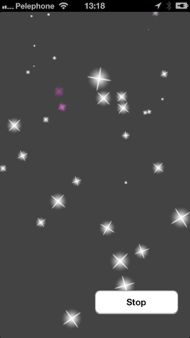

Snow
====

Snow Effect. CAEmitterLayer demo.



It's a simple class derived from UIView:

`````objective-c
@interface SnowEmitterView : UIView

- (void)start;
- (void)stop;

@end
`````

Just add it to your view:

`````objective-c
    CGRect bounds = [[self view] bounds];
    SnowEmitterView *viewSnow = [[SnowEmitterView alloc] initWithFrame:bounds];
    [[self view] addSubview:viewSnow];
    [viewSnow start];
`````
